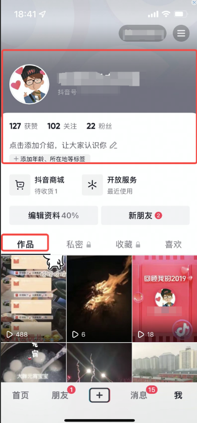

# qxy
# 抖音极简版项目介绍

 github的两个app？

```
名称为app的，是用来测试抖音sdk的测试
名称为myapplication的，是我们自己的，包也是com.qxy.guanfang2
```

我们目前的进度 0%

- 语言 java
- 安卓版本 lollipop 5.0
-  okhttp
-  数据库room
-  项目框架mvvm
# 我们需要完成的内容有

简洁版

- 榜单（三个）
- 个人界面
- 关注与被关注列表
- 竖版视频页详情

具体情况如下

- [ ] 榜单数据

  - [ ] 电影榜单

    

  - [ ] 电视剧榜单

    

  - [ ] 综艺榜单

    

- [ ] 综艺榜单的历史数据查询

- [ ] 个人界面的全展示

  

  - 头像
  - 城市
  - 国家
  - 性别
  - 昵称
  - 简介

- [ ] 粉丝和关注列表的展示

- [ ] 个人发布视频的展示

- [ ] 发布视频详情页的展示
